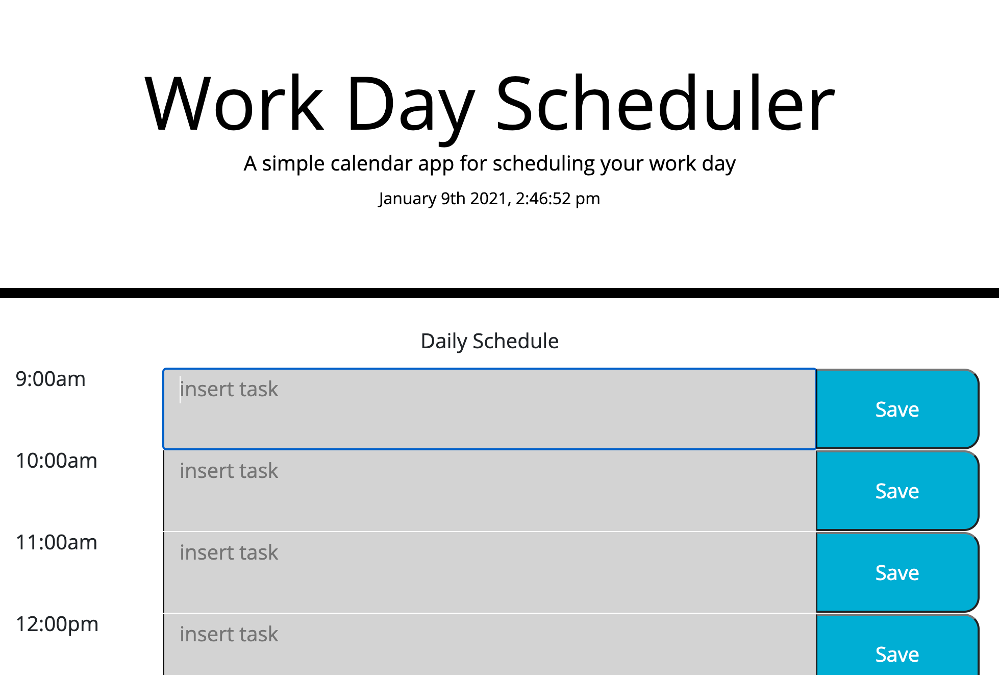

# Work-Day-Scheduler
Creating a scheduler

This project was about creating a scheduler.

We needed to save each task to the local storage.

We needed to display it next time you open the site. 

We needed to clear it the next day so we can add new taks on a new day.

We needed to add css to easily view past, present, and future based on the hour.

This was a especially difficult for me. I'm a little fuzzy with for loops, and there were a few required. I spent most of the time jumping around and going to something new when I would get frustad. I wasn't able to complete two items. 

1. reseting everything and clearing the task based on a new day.
2. saving tasks to the local storage wiht json stringify and bringing them back using json parse. I alo had a hard time keeping the information saved in the correct input field and brining it back in the correct input field, and combinging the corresponding save button with the correct field.

If I can get some reading material or hints or advice on how to make these things happen, that would be great and very helpful. Thanks in advance.

Below is a screen shot of the scheduler online

Below is a link to the repository 
https://github.com/HectorDiazJr/Work-Day-Scheduler

Below is al link to the scheduler  
https://hectordiazjr.github.io/Work-Day-Scheduler/

